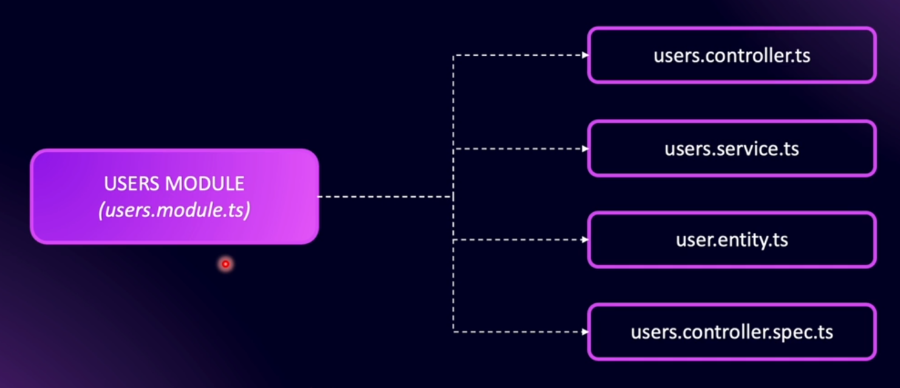
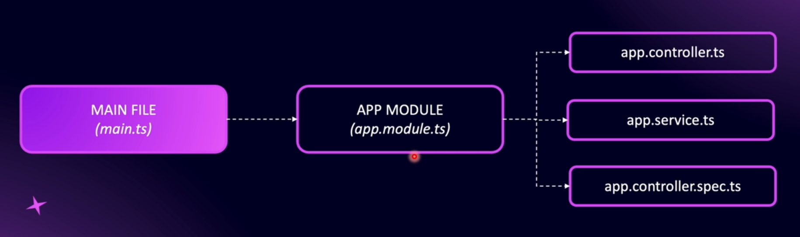
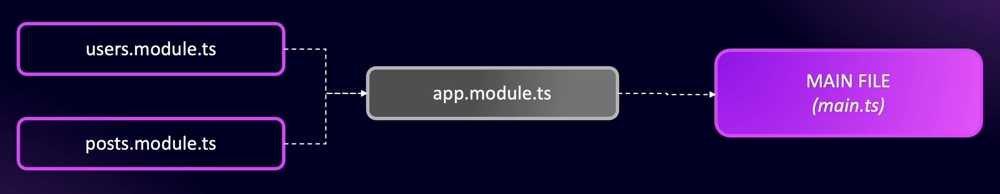
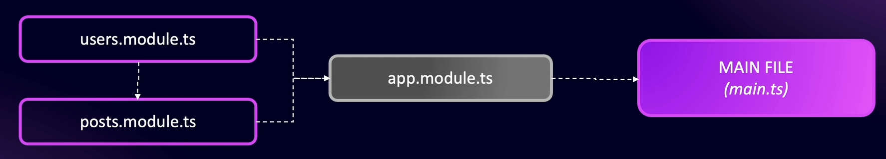

# What are Modules ?

A module is a package of specific functionality. In NestJS, a module encompasses all the files related to a particular entity or aspect of functionality within the application.

Inside a module, the primary file is named `<module-name>.module.ts`, which serves as the entry point to that specific module. One module can also be connected to other modules to build a structured and scalable application.

## Default Module Nest JS

Nest JS comes with default app module which is the main module for the entire application.

## Files in a Module

- **users.controller.ts** - Contains routing logic API endpoints

- **users.service.ts** - Logic related to a particular functionality.

- **user.entity.ts / user.schema.ts** - Database structure for users table / documents.

- **users.controller.spec.ts** - File to write test cases for users controller

## Connect to App Module

One module can have a dependency on another module in NestJS and can be used through **dependency injection**.

# How NestJs Bootstraps (main.ts)

To bootstrap (starting up / Initialize/ entry point) the application, NestJS uses the **main.ts** file.

NestFactory is used to create the application, and the `AppModule` (defined in **app.module.ts**) is the main module that NestJS relies on.

The `app` object (`const app = ...`) in NestJS represents the root application context created from `AppModule`. It manages all modules, providers, and dependencies inside the application.

# Understanding App Module

The `@Module` decorator makes a file the entry point of a module (not the naming convention like `<file-name>.module.ts`).

_(Extra: Naming conventions such as `.module.ts`, `.controller.ts`, etc., are mainly for developers’ readability. The file is actually recognized and controlled by the decorator, not by the file name.)_

Every other module created inside a NestJS application must be imported into **app.module.ts**. These imports bring together the rest of the modules into the main application.
