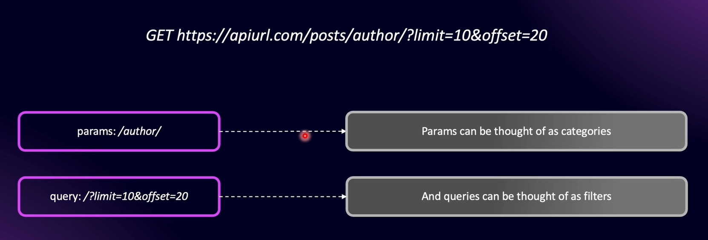

# What are Modules ?

A module is a package of specific functionality. In NestJS, a module encompasses all the files related to a particular entity or aspect of functionality within the application.

Inside a module, the primary file is named `<module-name>.module.ts`, which serves as the entry point to that specific module. One module can also be connected to other modules to build a structured and scalable application.


### Default Module Nest JS

Nest JS comes with default app module which is the main module for the entire application.


### Files in a Module

- **users.controller.ts** - Contains routing logic API endpoints

- **users.service.ts** - Logic related to a particular functionality.

- **user.entity.ts / user.schema.ts** - Database structure for users table / documents.

- **users.controller.spec.ts** - File to write test cases for users controller

### Connect to App Module


One module can have a dependency on another module in NestJS and can be used through **dependency injection**.


# How NestJs Bootstraps (main.ts)

To bootstrap (starting up / Initialize/ entry point) the application, NestJS uses the **main.ts** file.

NestFactory is used to create the application, and the `AppModule` (defined in **app.module.ts**) is the main module that NestJS relies on.

The `app` object (`const app = ...`) in NestJS represents the root application context created from `AppModule`. It manages all modules, providers, and dependencies inside the application.

# Understanding App Module

The `@Module` decorator makes a file the entry point of a module (not the naming convention like `<file-name>.module.ts`).

_(Extra: Naming conventions such as `.module.ts`, `.controller.ts`, etc., are mainly for developers’ readability. The file is actually recognized and controlled by the decorator, not by the file name.)_

Every other module created inside a NestJS application must be imported into **app.module.ts**. These imports bring together the rest of the modules into the main application.

# Creating a New User Module

`nest generate module users` - Generates a new module named "users" with a users.module.ts file

# What is REST API ?

**Official Definition** - The REST API or RESTful API is an Application Programming Interface (API) that conforms to the design principles of Representational State Transfer (REST) architectural style of programming.

## REST Design Principles

- Client Server Decoupling
- Uniform Interface
- Statelessness
- Cacheability
- Layered System
- Code On Demand (opt)

### 1. Client Server Decoupling

Client and Server applications must be completely independent of each other.


### 2. Uniform Interface

All API requests for the same resource should look the same, no matter where the request comes from


### 3. Statelessness

REST APIs are stateless, meaning that each request needs to include all the information necessary for processing it


### 4. Cacheability

When possible, resources should be cacheable both on the client side and server side. ( Goal is to increase the performance on client side(faster performance because the client can reuse cached data instead of calling the API again) and increase the scalability in the server end(reduced load and improved scalability, since fewer requests hit the origin server) )


### 5. Layered System

Neither he client nor the server can tell whether it communicates with the end application or an intermediary.


## Anatomy of API Endpoint


Note - Params are also called as Path Parameters, But NestJS specifically terms them as Params

### Params VS Query



# Creating Controllers

Controller contains all the routing logic of our application. The purpose of controller to receive an incoming request and based on the incoming request decides, which method should it trigger in order to process that particular request.


`nest generate controller users --no-spec` - Generate a Users controller without creating a test (spec) file

# Params, Query and Body

### Params

`@Get('/:id') `- required Param

`@Get('/:id?')` - optional Param (express 4)

`@Get('{/:id}')` or `@Get('/{:id}')` - optional Param (express 5)

Always put required route parameters first, then optional ones

```javascript
@Get('/:id{/:name}')
getUser(@Param('id') id: string, @Param('name') name?: string) {
  return `User ${id} - ${name ?? 'no name'}`;
}
```

### Query

```javascript
@Delete()
public deleteUser(@Query('limit') limit: string) {
  return `Delete a user - ${limit}`;
}
```

### Body

```javascript
@Post()
 public createUser(
    @Body('name') name: string,
    @Body('age') age: string,
  ) {
    return `Create user - Name: ${name}, Age: ${age}`;
  }
```

### Express Request Object

NestJS internally uses Express, so we can access the Express request object using `@Req()` and type it with the Express `Request` interface.

```javascript
@Post()
 public createUser( @Req() request: Request,) {
    return `Create user - Name: ${request.body.name}`;
  }
```

# Additional Request Components

`@Headers` - get the request headers

`@IP` - get the request IP address
