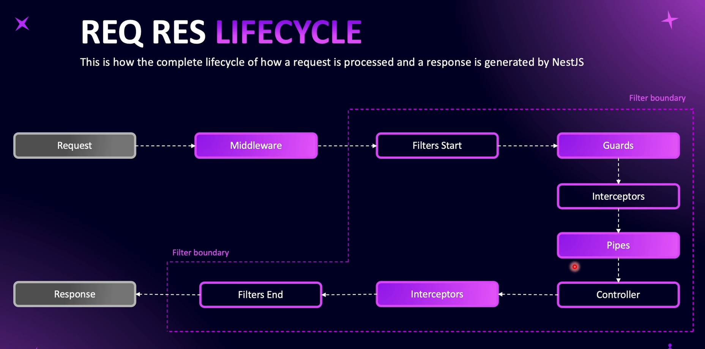
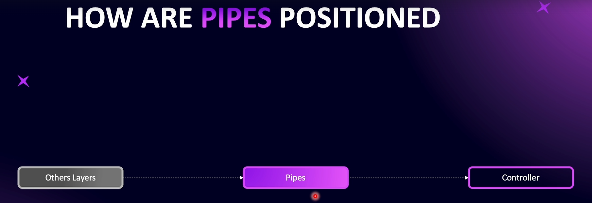
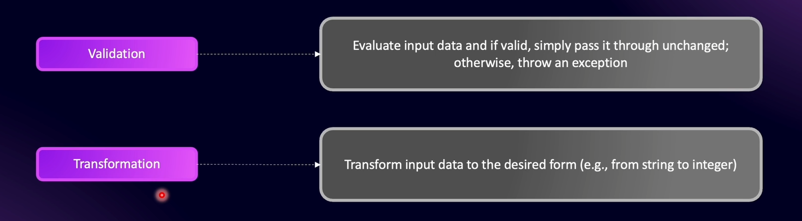
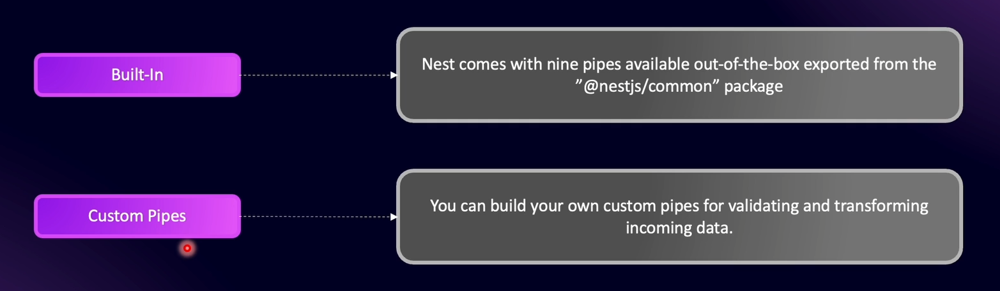

# What are Pipes ?

In NestJS, _filters_ mostly mean Exception Filters (for error handling).

Pipes run just before your request reaches the controller.

### Why Use Pipes

Pipes usually perform **two major functions**:

1. **Validation**

2. **Transformation**

### Type Of Pipes

# Validating Params with Built-in Pipes

Built-in pipes in NestJS require a value, so they don’t work well with optional parameters. To validate optional parameters, it’s better to use DTOs.

# Introduction to DTO

DTO - Data Transfer Object

In NestJS, a **DTO** is a class created using **class-validator**. Class-validator provides various **validation decorators** that can be used on each property of the object to enforce rules.

# Creating our First DTO

To validate DTOs, we should install the `class-validator`

# Connecting DTO to Route Method

`class-transformer` - transforms a DTO class into a proper class instance that we can use in our application.

# Global Pipes and Avoiding Malicious request

With a **Global Validation Pipe**, if a controller method has a **DTO class** associated with it, NestJS will automatically validate the incoming request.

- `whitelist: true` – If any property does not exist in the DTO, NestJS will _automatically remove_ that property before passing the data to the controller.

- `forbidNonWhitelisted: true` – If any property does not exist in the DTO, NestJS will _throw a validation error_ instead of silently removing it.

# Converting to an Instance of DTO

`transform: true` – Converts the incoming request data into an **instance of the DTO class.**

- Until this is enabled, the data is just a plain JavaScript object and **not an instance** of the DTO.

- With `transform: true`, strings and other primitive types will be **automatically converted to** the appropriate types defined in the DTO.

- NestJS will then validate the object(nested objects), and any methods defined in the DTO class will be accessible.
