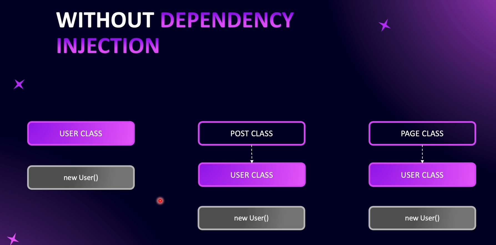
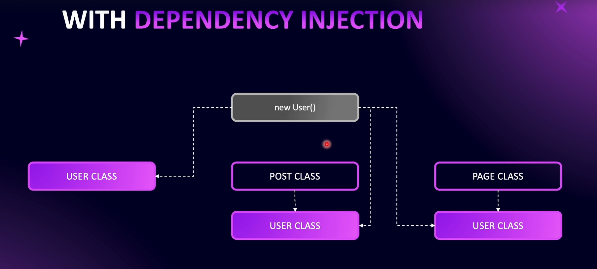
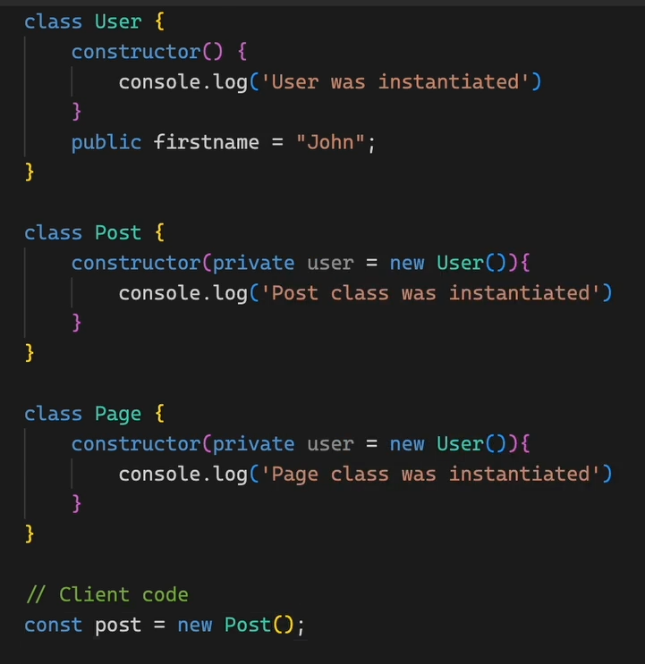
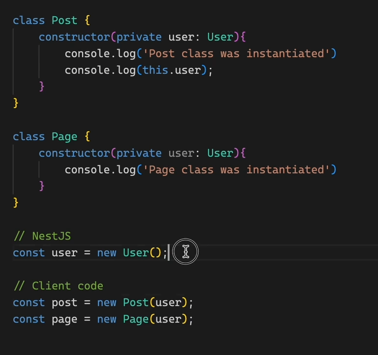

# Introduction to Inversion Of Control

Here User Class is the Dependency

### TypeScript Example - Without Dependency Injection

In this code, whenever we create a new `Post` or `Page` class, we instantiate the User class inside them.
This means we are relying on creating a new instance of `User` (concrete implementation) whenever it is needed, and we are not using dependency injection.

### TypeScript Example - Without Dependency Injection

In this example, we depend on the `User` **interface** rather than directly creating a new instance of the `User` class.

Whenever we create a `Post`, it requires a `User`, but the `Post` class itself **does** not create a new `User` instance. Instead, an already created `User` instance is **passed down** to the Post class.

This way:

- The `Post` class can keep using the `User` it was given.
- The `Post` class does **not** need to know how to create a `User`.
- The responsibility of creating the `User` object is handled **somewhere else** (outside the `Post` class).

This approach is called **Inversion of Control (IoC)** because the responsibility of creating dependencies is inverted and given to an external provider.

In **NestJS**, this responsibility is handled automatically by the framework.

NestJS instantiates the `User` class once and **injects it** into the `Post` and `Page` classes whenever they need it.

This way, `User` is created only once, and the same instance is reused as a dependency.
