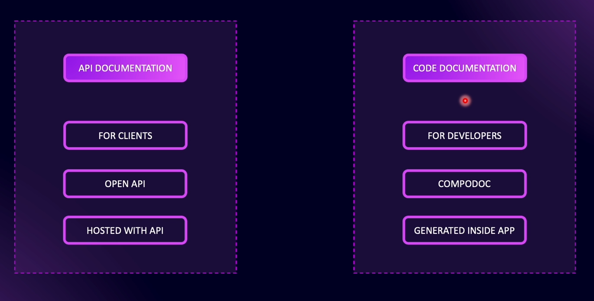

# Documenting with Nest JS

### Types of Documentation

# Open API Specification

The **OpenAPI Specification** is a standard for describing APIs. It provides a structured format to define API endpoints, their inputs, outputs, and other details.

**Swagger** is an open-source toolset that works with the OpenAPI Specification to design, build, and document APIs. Swagger includes multiple tools, but in **NestJS**, the most commonly used tool is **Swagger UI** for API documentation.

Although Swagger has its own ecosystem, when used with NestJS, it still **follows the OpenAPI Specification.**
