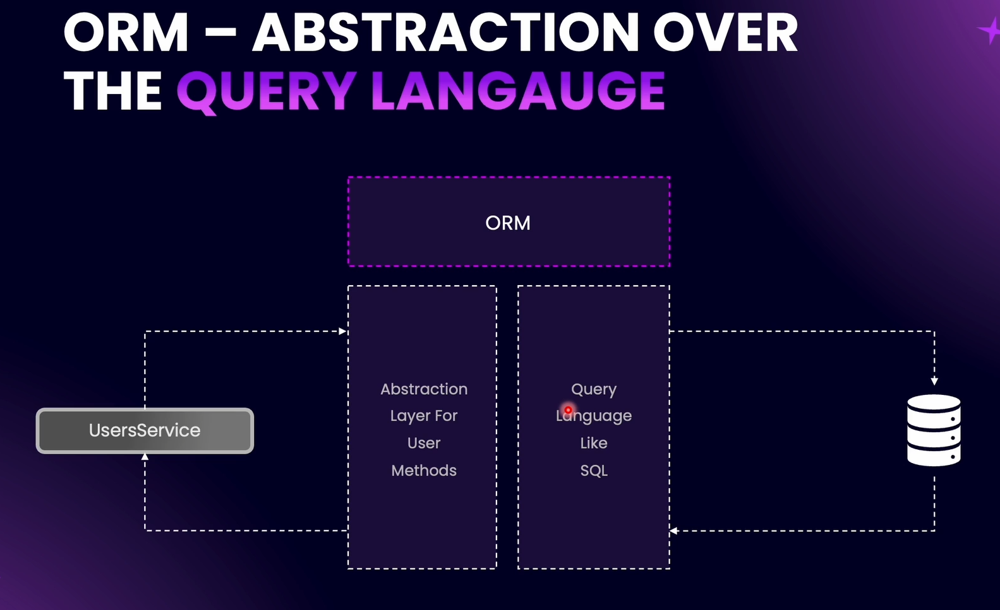

# Working with Databases in NestJS

In NestJS, only the service file is responsible for working with the database. However, there is one layer between the service and the database — the ORM (Object Relational Mapping).

---

The supported databases are not limited to the ones shown; NestJS supports many more.

# What is an ORM ?

---

---

---

---

---

### ORM - Disadvantages

- Less Control Over Low Level Code

- In Case of Complex Queries, Performance Optimization can be a problem ( But we can pass raw sql queries using ORM too )

# Connecting NestJS to PostgreSQL

`npm i typeorm` - Install TypeORM, the ORM (Object Relational Mapper) for Node.js/TypeScript

`npm i @nestjs/typeorm` - Install the NestJS integration for TypeORM, so you can use it in NestJS projects

`npm i pg` - Install the PostgreSQL driver for Node.js, required for TypeORM to connect to PostgreSQL

# Using Async Configuration

The advantage of having an asynchronous connection is that we can **directly inject the configuration object** into our database settings. This allows us to **read configuration from different environment files.**
