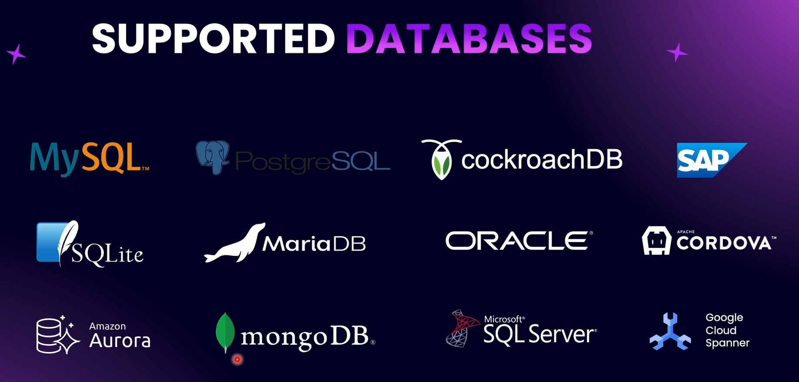

# Working with Databases in NestJS

In NestJS, only the service file is responsible for working with the database. However, there is one layer between the service and the database — the ORM (Object Relational Mapping).

The supported databases are not limited to the ones shown; NestJS supports many more.
