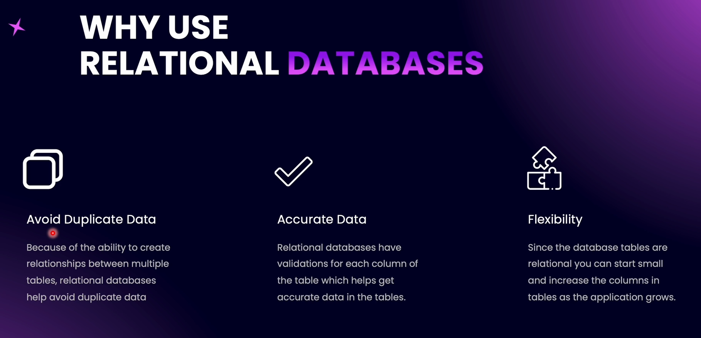
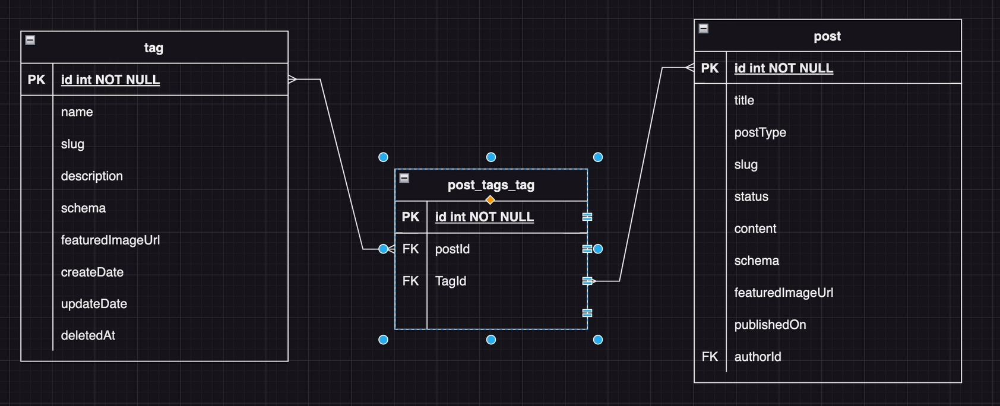

# Relationships in SQL Database



### Types of Relationships

1. One-to-One relationship
2. One-to-Many relationship / Many-to-One relationship
3. Many-to-Many relationship


---


---


# Auto-Loading Entities

In TypeORM, you can set `autoLoadEntities: true` to avoid listing all entities in app.module.ts, but each entity still needs to be imported in its own module.

# One-to-One Relationship

One to One relationships have two types.

1. Uni-directional One to One relationship
2. Bi-directional One to One relationship

# Uni-Directional One To One Relationship


A post can have only one metaOption.

In a **uni-directional one-to-one relationship**, only one entity is aware of the relationship. Here, the Post entity knows about the relationship, while the **MetaOptions** entity does not.

If both entities are aware of the relationship, it becomes a **bi-directional one-to-one relationship**.

To add a uni-directional relationship, we use two decorators:

- `@OneToOne` → defines the relationship with the other table.
- `@JoinColumn `→ creates the column to maintain the relationship.

# Cascade Creation with Relationship

With cascade enabled, we can automatically apply related operations (such as insert, update, or delete) to the associated entities

- `Insert`: automatically insert the related entity if it doesn’t exist.
- `Update`: update the related entity if it already exists (i.e., it has an id).
- `Remove`: remove the related entity if you explicitly remove it.

# Querying with Eager Loading

If we want to get related data, the first option is to use the relations option. TypeORM will fetch the related data as well. ( This is known as explicit loading.)

```javascript
let posts = await this.postsRepository.find({
  relations: { metaOptions: true },
});
```

Alternatively, we can configure the relation itself with eager: true, so TypeORM automatically loads the related entity whenever we fetch the main entity: ( This is known as eager loading)

```typescript
 @OneToOne(() => MetaOption, { cascade: true, eager: true })
  @JoinColumn()
  metaOptions?: MetaOption;
```

# Deleting Related Entities

In Uni-Directional One-to-One relationship, Cascade delete is not possible, So we have to perform sequential delete. ( One row of one table and then go to other table)

# Bi-Directional One-To-One Relationship

In a bi-directional relationship, both entities are aware of the relationship. The foreign key can reside in either table, but it will be placed on the side where the `@JoinColumn` decorator is used.

# Creating a Bi-Directional Relationship

In a _uni-directional one-to-one relationship_, we can only navigate from one entity to the other (for example, we can find `metaOptions` through the `post` table, but we cannot find a `post` using the `metaOptions` table).

When we enable a bi-directional relationship, we can navigate in both directions — meaning we can find either entity through the other.

# Cascade Delete with Bi-Directional Relationship

Currently, the foreign key is in the **Post** table.

However, to enable cascade delete from the Post entity, the foreign key should be in the **MetaOptions** table. This is because what we need is: when deleting a Post, its related MetaOption should also be deleted — not the other way around (deleting a MetaOption should not delete the Post).

My Explanation - The reason is that normally, we cannot delete a record if its ID is still referenced elsewhere. By placing the foreign key in the MetaOptions table, when we delete a Post, the database sees that it has a related MetaOption and deletes MetaOption record first, before deleting the Post itself.

---

### Therotical Explanation

- One of the tables must hold the foreign key.

- That table is considered the owner of the relationship. ( So, In relationship, Owner is dependat on the other table)

_Being the owner in TypeORM just means “this side has the foreign key._

My Note - The entity that has FK is also considered as the child

#### Who is Parent vs Dependent?

- Parent (Principal) → Post

  - It does not depend on MetaOption.

  - A Post can exist without a MetaOption (if you design it that way).

- Dependent (Child) → MetaOption

  - It depends on Post, because it has a foreign key (postId).

  - It cannot exist without referencing a Post.

**Cascade delete** = `when the` **`parent row`** `is deleted, the dependent row(s) with the FK are automatically deleted by the database (ON DELETE CASCADE).`

#### Cascade Delete Behavior

If you delete a Post (parent) → the database will also delete the related MetaOption (child) because of ON DELETE CASCADE.

If you delete a MetaOption (child) → nothing happens to the Post, since the parent does not depend on the child.

# One to Many Relationshop


A **User** has a _one-to-many relationship_ with **Post**, and a **Post** has a _many-to-one relationship_ with **User** (e.g., many posts, and each post belongs to one user).

One user can have many posts, while one post can have only one user.

_One-to-Many / Many-to-One relationships_ are considered bi-directional relationships.

The _foreign key_ always lies on the **Many** side.

In the case of Many-to-One and One-to-Many relationships, we don’t have to use the `@JoinColumn` decorator on the One-to-Many side. The `@JoinColumn` always lies on the **Many-to-One side**.

#### Extra ->

A _Many-to-One relationship_ can be _uni-directional_, meaning we only access the User from a Post. However, if we also want to access all posts from a user (One-to-Many), it becomes **bi-directional**.

In many cases, _One-to-Many_ and _Many-to-One go_ hand in hand. So, we usually treat _One-to-Many_ and _Many-to-One_ as a **bi-directional relationship** between two entities.

# Many to Many Relationship



Here , An Intermediate table is created to manage the relationship.

In _Many to Many relationship_, We can have _uni-directional relationship_ as well as _bi-directional relationship_.

# Uni-Directional Many to Many Relationships

Just like a one-to-one relationship, a many-to-many relationship also requires a decorator called `@JoinTable`. This `@JoinTable` decorator must be placed on the entity that is on the owning side of the relationship.

In this case, `Post` will be the owning side of the relationship because we need to fetch tags along with the posts as part of the post (We don't need to fetch posts through tags.). This setup is used for **uni-directional relationships**.

# Querying Many to Many Relationship

Just like in one-to-one and many-to-one relationships, when querying we can use **explicit loading** (by specifying `relations`) or **eager loading**.

# Deleting Post and Relationship.

In a _uni-directional many-to-many relationship_, the table that defines the foreign key through the `@JoinColumn` is considered the **owning side** of the relationship.

For example, if the `Post` entity has a many-to-many relationship with `Tag`, an intermediate table `post_tags` is created. Since `Post` is the owning side, when we delete a `Post`, the associated records in `post_tags` that reference that post are also deleted automatically if **cascade delete** is enabled. ( By Default Cascade Delete will work automatically in Uni Directional Many to Many Relationship)

This happens because in a uni-directional relationship, we only need to access `Tags` through `Post`. Therefore, when a `Post` is removed, its related join entries are also removed, as they are no longer needed.

# Bi-Directional Many to Many Relationship

In a **bi-directional relationship**, we can query from either side. For example, when searching for a `Post`, we can also retrieve its related `Tags`. Similarly, when searching for a `Tag`, we can retrieve its related `Posts`.

In other words, bi-directional means we can navigate the relationship from both sides.

# Cascade Delete with Many To Many

In a **many-to-many relationship** (e.g., between `Post` and `Tag`), the join table holds the foreign keys. When we delete a `Post`, the related records in the join table are deleted automatically if cascade is configured( Mostly, It is automatically configured).

However, if we try to delete a `Tag` that is still referenced in the join table, it will not work automatically. To allow this, we need to explicitly configure **cascade on delete** for the `Tag` side as well, so that records in the join table are removed when a `Tag` is deleted.
