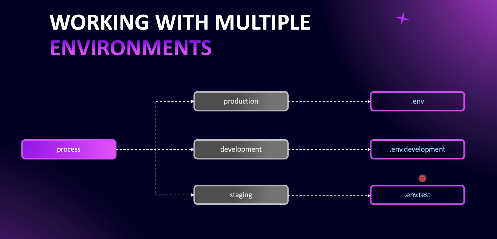
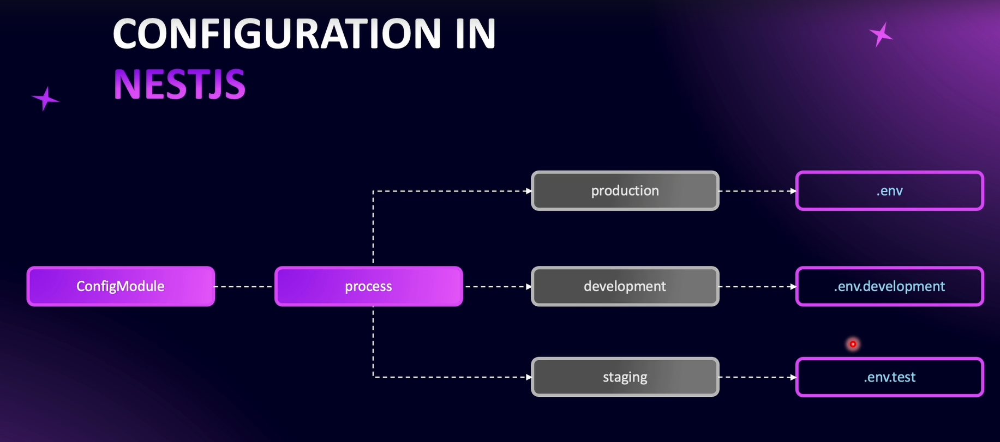

# Introduction to Environments

In NestJS, **.env** files store environment variables, and the **Config Module** loads them into your app. This makes accessing configuration values easy, secure, and consistent.

(We use the process object to read these variables at runtime.)



---



# Installing Config Module

`npm i @nestjs/config`

If we don’t set `isGlobal: true` in the Config Module, we have to import the Config Module in every module where we need it. But if we enable `isGlobal: true`, we don’t need to do that since it makes the Config Module available everywhere automatically.

# Confirming NODE_ENV While Testing

When testing NestJS applications, Jest automatically sets NODE_ENV to test.

**Extra** - For unit tests, Jest uses the configuration in package.json, and for end-to-end (e2e) tests, it uses the configuration in jest-e2e.json.

# Conditionally Loading Environments

In MacOS/Linux = `"start:dev": "NODE_ENV=development nest start --watch"`

In Windows - Above is not working.

1. **First Option** - use _cross_env_ package

`"start:dev": "cross-env NODE_ENV=development nest start --watch"`

2. **Second Option** - use windows Specific

`"start:dev": "set NODE_ENV=development&& nest start --watch"` - Works only in Windows Command Prompt. Won’t work in Linux/macOS.

#### Extra -

There are two ways to read the env details from `.env` file.

1. **Directly read from _env_ file**

```javascript
console.log("From Env", process.env.S3_BUCKET);
```

2. **Read from ConfigModule**

```typescript
const environment = this.configService.get<string>("S3_BUCKET");
console.log("Environment Variable:", environment);
```

# Custom Configuration Files

Custom configuration files are files that read from environment variables, and we can use those files to assign environment variables wherever needed.

The advantage of creating such configuration files is that we can have different files for different modules and functionalities of the application (for example, we can have a separate file for database credentials).

Note: It is okay to read variables in _configuration files_ and _app.module.ts_ through `process.env` . However, in other parts of the application, you should use the `ConfigService` to read the application configuration.

# Config Files with Namespaces

The `registerAs` function in NestJS allows us to register our configuration object under a **namespace**.
