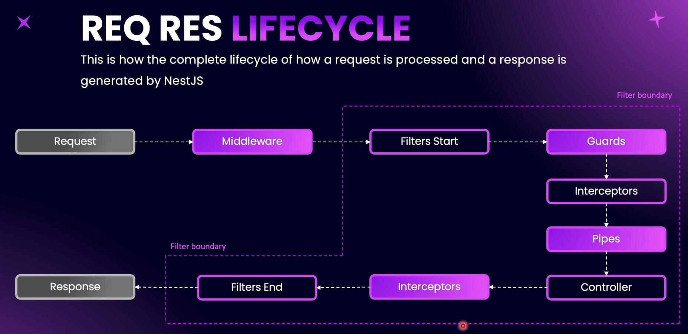
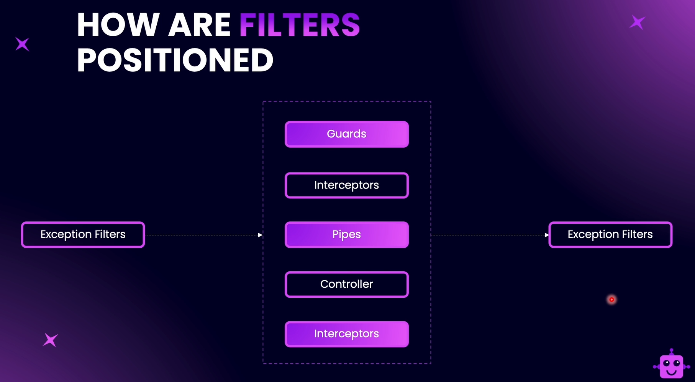
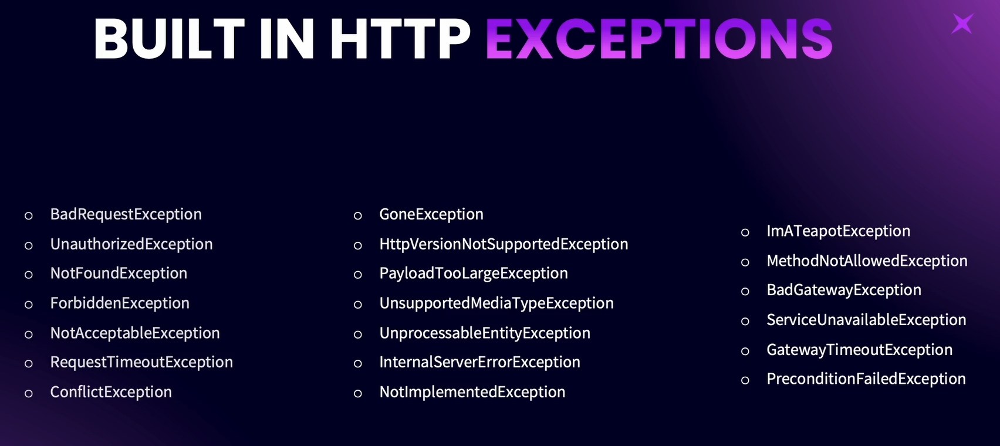
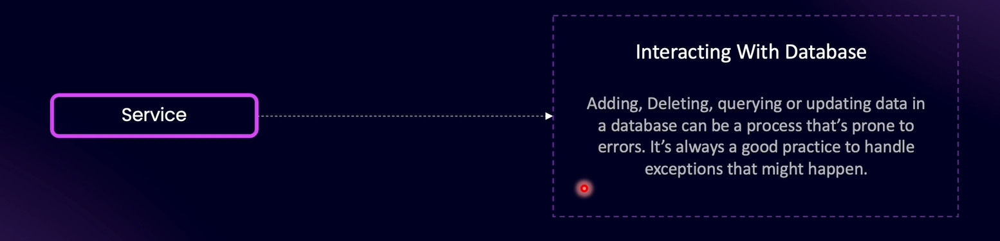
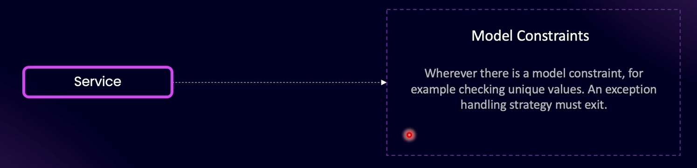
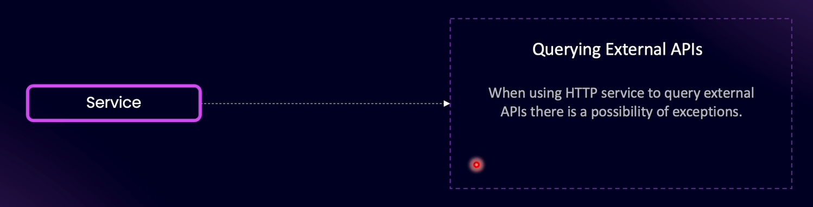

# Introduction to Exception Handling

Within the filter boundary, NestJS takes care of handling exceptions automatically. (NestJS has a built-in **exception handling layer**. If an exception is thrown inside your application and isn’t caught, NestJS will automatically handle it using its **global exception filter**. By default, it turns unhandled exceptions into a proper HTTP response.)

---

NestJS comes with many prebuilt exception classes and methods.

# Identifying Points of Failure

### 1. Querying a Database

### 2. Model Constraints in a Database

### 3. External APIs

**Note**: Even in middleware, it is important to handle exceptions. We can throw exceptions in middleware. (Middleware do not come under NestJS’s automatic exception handling. If something breaks in middleware and we don’t handle it, NestJS will not automatically send a 500 Internal Server Error — we must handle it manually. )
