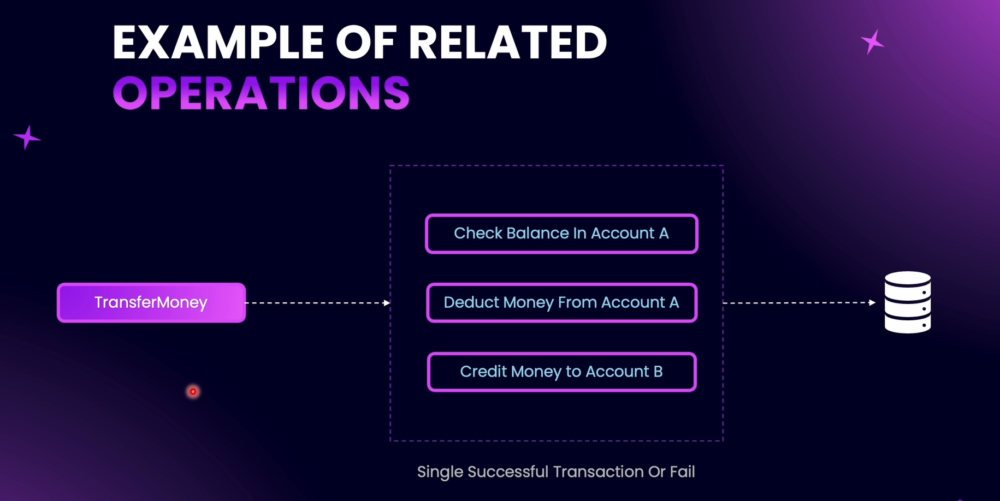
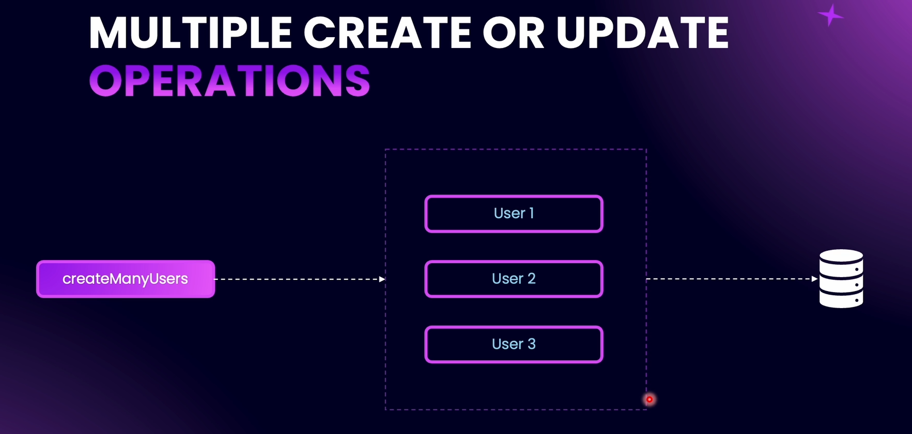
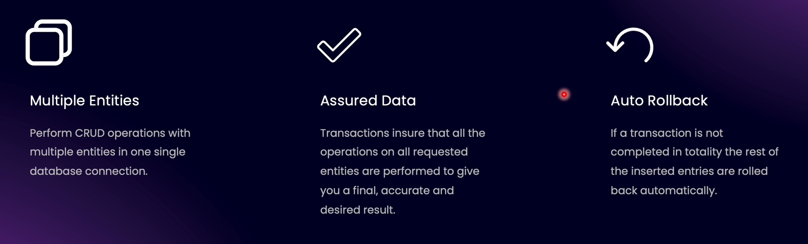
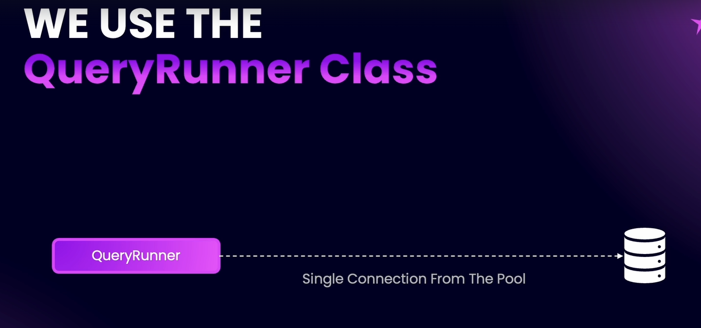
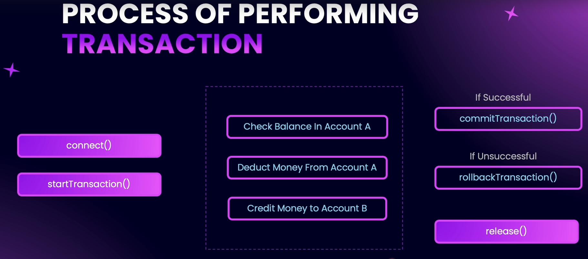

# Understanding Transactions

Transactions can be defined as a complete set of CRUD operations on a database. These database operations are interrelated, so even if one operation fails, the entire transaction becomes invalid and should fail.

If any of the operations above fail, the whole transaction is meaningless. A transaction is a single unit of database CRUD operations, which are closely related to each other. If any part of the transaction fails, we should be able to revert the database back to its initial state.

This might not be a perfect example, but it can be used as an illustration in our application.

### Why to use Transactions ?

# TypeORM QueryRunner

`QueryRunner` is a class, and we use an instance of this class to perform transactions. `QueryRunner` provides a single connection from the pool of connections available in the database. Most SQL databases used with TypeORM have a connection pool.

A connection pool is a collection of reusable connections, with a maximum number of connections that can exist in the database. QueryRunner gives a single connection from this pool. While performing transactions, we do not use multiple connections with the database—just a single connection.

