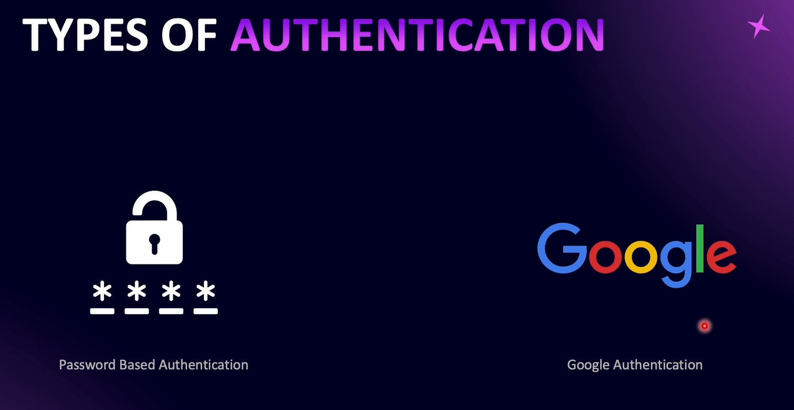
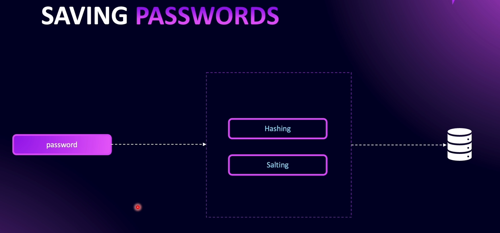

# Introduction to Authentication



---



---


---


# Hashing and Salting Password


**Hashing** is the process of generating a **fixed-size output** (hash) from an input of variable size (like a password).

**Hashing** is done using **mathematical functions called hash functions**. It is a **one-way process**, meaning once a password is hashed, it **cannot be reversed** to reveal the original password.

**Note**: Hashing is **not encryption**. Encryption transforms a password into another form that can be decrypted later. Hashing is irreversible.

### Comparing Passwords

To verify a password, the system hashes the **input password** using the same hash function and parameters, then compares it to the stored hash in the database. If the hashes match, the password is correct.


### Salting

**Salt** is random data added to a password **before hashing** to make it more complex and prevent attacks like **rainbow table attacks.**


### Bcrypt

Bcrypt is a popular hashing algorithm. It **stores all necessary information** inside the hash string itself, including:

- The hash algorithm
- Cost factor (number of iterations)
- Salt

This allows bcrypt to **verify passwords without storing the salt separately.**


# User Signup

When we reference **abstract classes** in a module file, we use a slightly different approach: we pass an **object** and specify what is being **provided** and what is the **concrete implementation**.

This is helpful because later, if we need to **change the implementation**, we only have to change it in **one place**, without updating all the places where the abstract class is used.

`npx nest g pr /users/providers/create-user.provider --flat --no-spec` - Create provider using terminal

# Understanding JWTs

### What are JWTs


### How Does JWT Look Like


A JWT is divided into three parts, separated by periods (.):

1. Header
2. Payload
3. Signature

### JWT Header

The header contains metadata about the token, such as the algorithm used to generate the signature and the type of token.


### JWT Payload

The payload includes the data that we send back to the user. It is customizable and can contain both standard and custom claims. For example, the `sub` claim usually refers to the user’s ID in the database.

**Important**: The payload of a JWT is **not encrypted** — it is only _Base64-encoded_. This means anyone can decode and read it. Therefore, **sensitive information should never be included in a JWT.**


### JWT Signature

The signature ensures the integrity of the token.

It is generated by:

1. Taking the Base64-encoded header and payload.
2. Combining them.
3. Applying the chosen algorithm with a secret key.

The result is the signature (the third part of the JWT).

If someone tries to tamper with the header or payload, the signature will no longer match. The exact signature can only be generated with the secret key, which is securely stored on the server.

Only the server (or whoever has the key) can validate and recreate the signature. Thus, by checking the validity of the signature, we can confirm whether a JWT is authentic and untampered.


---

1. **Header** → Base64Url encoded JSON (e.g., `{ "alg": "HS256", "typ": "JWT" }`)

2. **Payload** → Base64Url encoded JSON (e.g., `{ "sub": "123", "name": "Ayeshan" }`)

3. **Signature** → Created by taking **(encoded header + "." + encoded payload)** and running it through the algorithm with the **secret key**.

```
signature = HMACSHA256(
   base64UrlEncode(header) + "." + base64UrlEncode(payload),
   secretKey
)
```


---


---


Every time the client sends a JWT, the server verifies its **signature**:

- If the signature is **valid**, the server trusts the token and processes the request.
- If the signature is **invalid**, the server rejects the request.

Additionally, JWTs include an **expiration time** (`exp` claim). Any request made after this time will be rejected, even if the signature is correct.

This ensures that only valid and untampered tokens within their lifetime are accepted as authentic.
