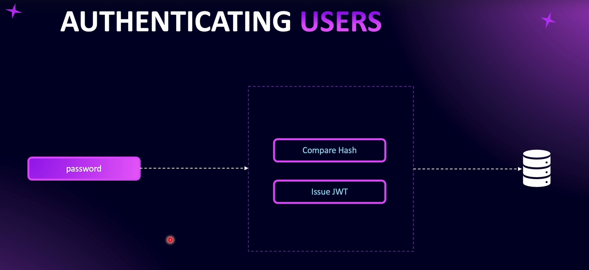

# Introduction to Authentication

---

---

---

# Hashing and Salting Password

**Hashing** is the process of generating a **fixed-size output** (hash) from an input of variable size (like a password).

**Hashing** is done using **mathematical functions called hash functions**. It is a **one-way process**, meaning once a password is hashed, it **cannot be reversed** to reveal the original password.

**Note**: Hashing is **not encryption**. Encryption transforms a password into another form that can be decrypted later. Hashing is irreversible.

### Comparing Passwords

To verify a password, the system hashes the **input password** using the same hash function and parameters, then compares it to the stored hash in the database. If the hashes match, the password is correct.

### Salting

**Salt** is random data added to a password **before hashing** to make it more complex and prevent attacks like **rainbow table attacks.**

### Bcrypt

Bcrypt is a popular hashing algorithm. It **stores all necessary information** inside the hash string itself, including:

- The hash algorithm
- Cost factor (number of iterations)
- Salt

This allows bcrypt to **verify passwords without storing the salt separately.**

# User Signup

When we reference **abstract classes** in a module file, we use a slightly different approach: we pass an **object** and specify what is being **provided** and what is the **concrete implementation**.

This is helpful because later, if we need to **change the implementation**, we only have to change it in **one place**, without updating all the places where the abstract class is used.

`npx nest g pr /users/providers/create-user.provider --flat --no-spec` - Create provider using terminal
