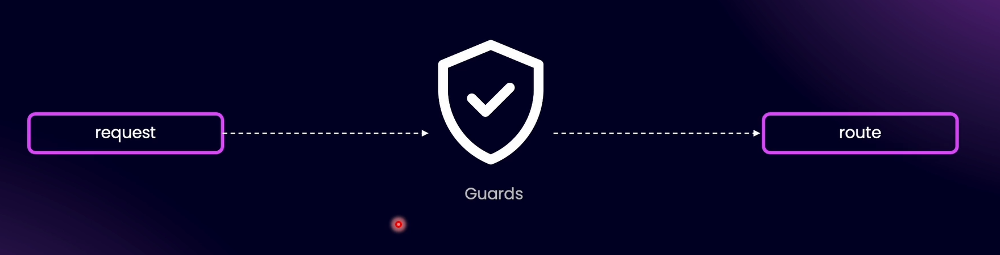
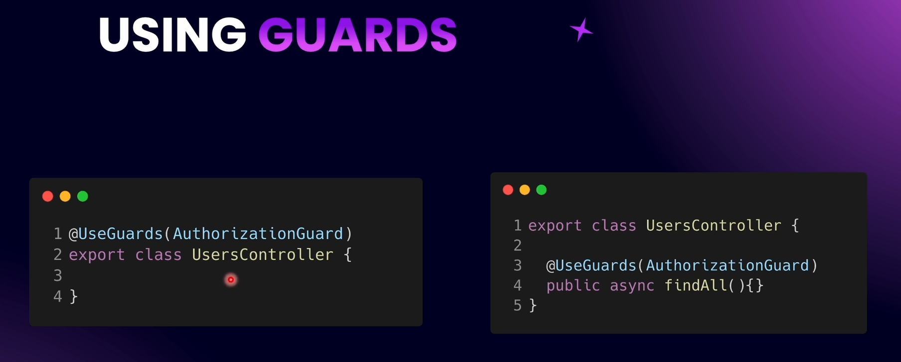
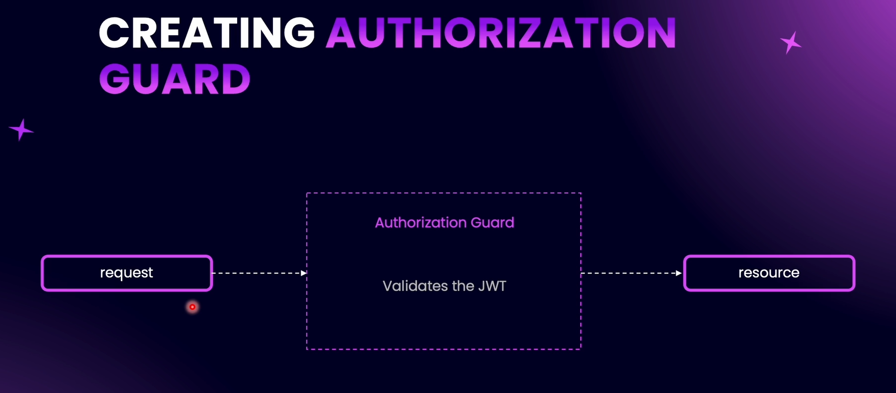

# Introduction to Guards

The purpose of a guard is to approve or disapprove a request.



Guards can be used with a controller class as well as a controller method. They can also be applied globally to a module or the entire application.



---



# Creating AccessToken Guard

Every guard should implement the `canActivate` method.

# Testing the AccessTokenGuard

Unlike services, when we use a guard, pipe, or interceptor in another module (apart from the module where it was created), the other module must have all its dependencies available to resolve them.

| Feature                                              | Consuming Module Needs Dependencies? | Why                                                                                                   |
| ---------------------------------------------------- | ------------------------------------ | ----------------------------------------------------------------------------------------------------- |
| **Service injected into another service**            | No                                   | NestJS uses the instance provided by the module that created it, dependencies resolved internally.    |
| **Guard/Pipe/Interceptor applied in another module** | Yes                                  | NestJS instantiates it in the consuming module’s context, so it needs all dependencies visible there. |

- **Services**: consuming module sees only the service. Dependencies handled internally.

- **Guards/Pipes/Interceptors**: consuming module must see **all dependencies**, because NestJS creates the instance in that module.

# Applying AccessTokenGuard Globally

```typescript
@Module({
  controllers: [UsersController],
  providers: [
    UsersService,
    UsersCreateManyProvider,
    CreateUserProvider,
    FindOneUserByEmailProvider,
    {
      provide: APP_GUARD, // Apply the guard globally to all routes in this application
      useClass: AccessTokenGuard,
    },
  ],
  exports: [UsersService],
  imports: [
    forwardRef(() => AuthModule),
    TypeOrmModule.forFeature([User]),
    ConfigModule.forFeature(profileConfig),
    ConfigModule.forFeature(jwtConfig),
    JwtModule.registerAsync(jwtConfig.asProvider()),
  ],
})
export class UsersModule {}
```

If we set the `AccessTokenGuard` in **one of the module files** (e.g., `UsersModule` or `PostsModule`), it will not be limited to that module. Instead, it will be applied to the entire application (all modules).

But it can sometimes confuse developers. To avoid this confusion, it’s better to apply the guard in the **AppModule**, as that makes more sense and keeps the intent clear.

Extra - When you use `@UseGuards()` on a controller or route, NestJS tries to instantiate that guard **within the module of the controller**, so all of the guard’s dependencies must be available in that module.
Even if the guard is already registered globally in `AppModule`, using `@UseGuards()` locally forces Nest to create a new instance in the controller’s module, and if the dependencies aren’t imported there ( in that particular module), it will fail.
