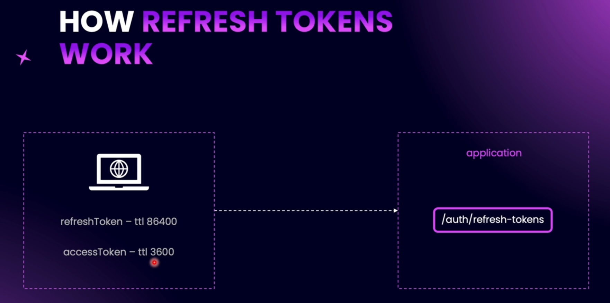

# Introduction to Refresh Tokens

**Access tokens** act as identity files. If they are stored on a computer within the browser, anyone who gains access to that browser can steal the access token and use it for authentication. That’s why the shorter the access token’s lifetime, the higher the security.

A **refresh token** allows you to generate a new access token. It cannot be used as a replacement for an access token, but it can be used to obtain a fresh one once the old one expires. Access tokens have a shorter time-to-live (TTL), while refresh tokens have a longer TTL. Refresh tokens are also JWT tokens.

It is important to keep the payloads of access tokens and refresh tokens different, so they cannot be used interchangeably.

When a user signs in, both an **access token** and a **refresh token** should be returned. The purpose of returning both tokens is so that the frontend application can store them (in local storage or cookies, depending on the strategy).

In the frontend application, developers usually track when the access token was issued. As soon as the access token is about to expire, without letting the user know, the frontend silently sends a request to the server to generate a new set of tokens (both refresh and access tokens).

To generate a new set of tokens, the server only needs the refresh token. The server validates the refresh token and issues a new access token (and optionally a new refresh token).
