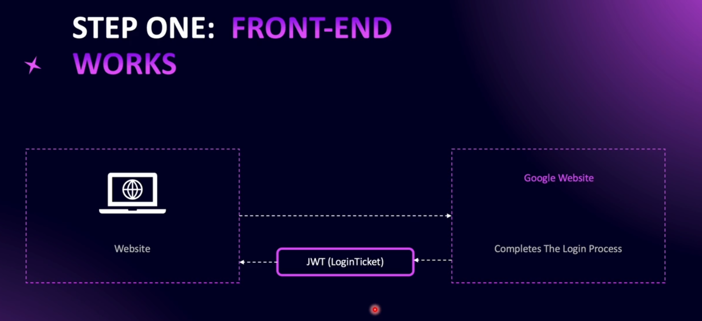
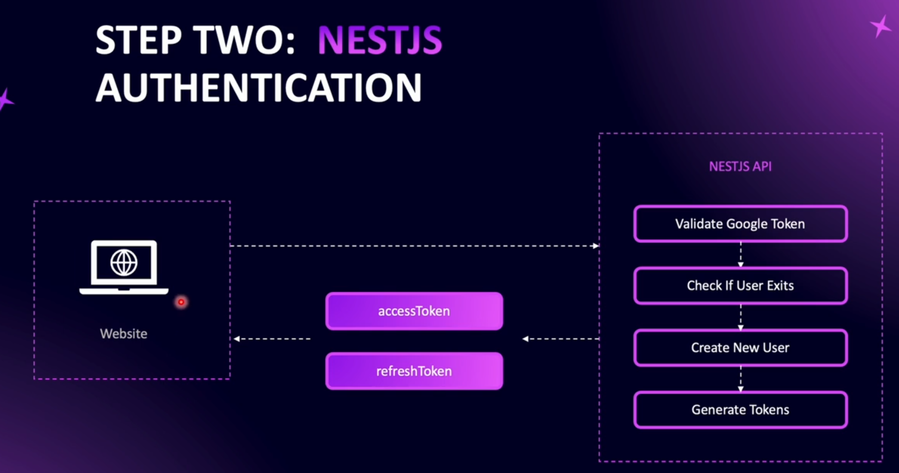

# Google Authentication Strategy

In the frontend of our application, Google authentication is initiated by the user. The user visits our website and clicks the **Sign in with Google** button. Once the button is clicked, the user is redirected to the Google website.

On the Google site, the authentication process takes place. The user signs in to their account, chooses which account to use for authentication, and grants permission for our application to access the requested information. Once this login process is completed, Google generates a **JWT token called a LoginTicket** and sends it back to our website.

After the user has authenticated and we receive the response from Google (in the form of the JWT LoginTicket), the frontend sends the token to NestJS API.

Once the user’s JWT is sent to our backend NestJS API, the server first validates the Google authentication token using the **client ID** and **secret** provided by Google.

After validation, we check whether the user already exists in our database:

- If the user is signing up for the first time, we create a new user.
- If the user already exists, we use the existing user.

In either case, we generate our own tokens for the user to use within our application.

# Setting the Configuration

In order to use Google Authentication, we should install google-auth-library.

`npm i google-auth-library`
