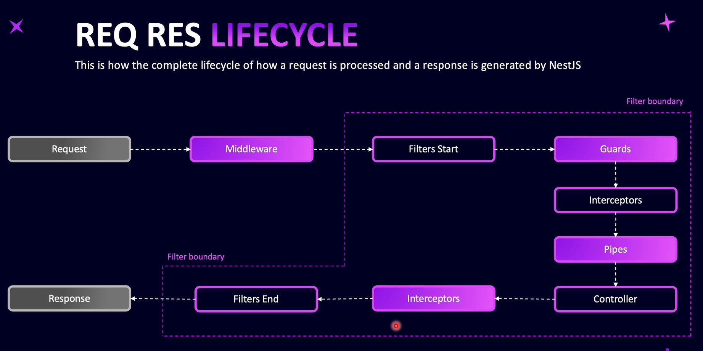
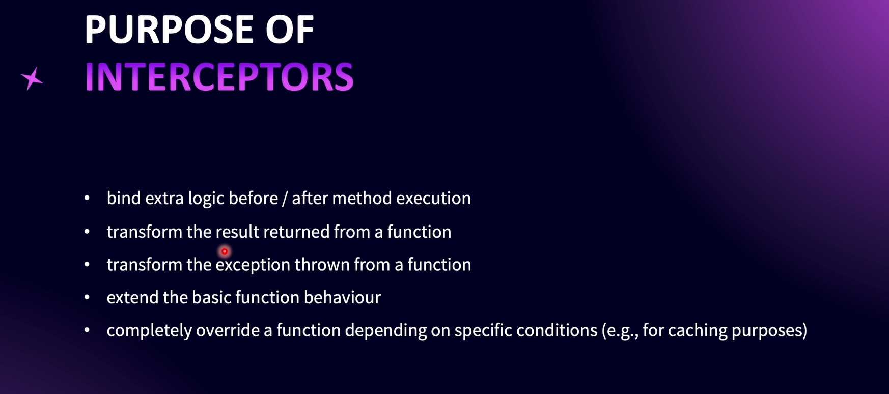
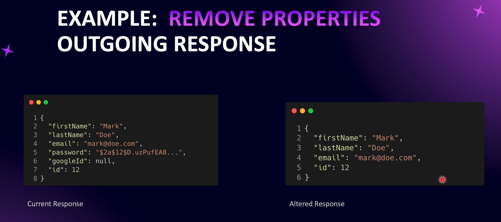
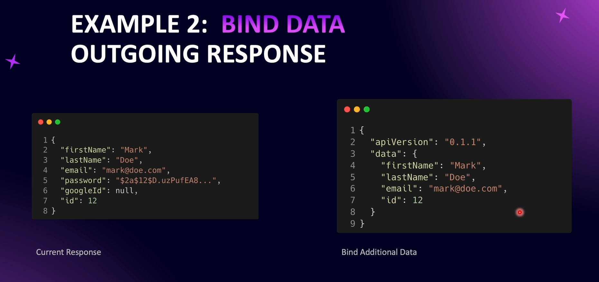

# Introducing Interceptors and Serialization

Interceptors are execute twice in the execution lifecycle. Once before request reaches the controller method and after the request is processed by the controller.

---

---

